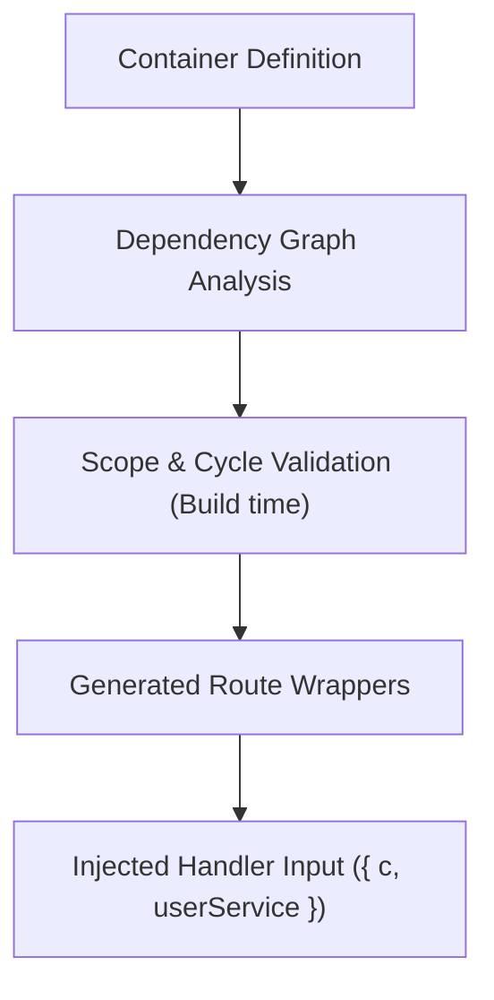

Nooh includes a lightweight, compile-time dependency injection (DI) system built specifically for modular, testable backend architectures with zero runtime reflection overhead.

## Why Compile-Time DI?

Traditional DI frameworks in Node.js often rely on experimental decorators, `reflect-metadata`, and heavy runtime container scanning. This leads to:

- Slow cold starts in serverless and edge environments.
- Hidden runtime crashes when a dependency is missing or misconfigured.
- Bloated bundle sizes.

Nooh takes a different approach: **type-level dependency validation with static resolution graphs**.



## Containers & References

Dependencies are declared inside a **container** using the `container()` function:

```ts src/dependencies.ts
import { container, singleton, request, value } from "@nooh-ts/nooh";
import { Database } from "./services/database";
import { UserService } from "./services/user";
import { RequestContext } from "./services/context";

export const services = container({
  config: value({ apiUrl: "https://api.example.com" }),
  
  db: singleton(() => new Database()),
  
  userService: singleton({
    deps: [services.db, services.config],
    factory: ({ db, config }) => new UserService(db, config),
  }),

  requestContext: request(() => new RequestContext()),
});
```

Every property in the container object is a `DependencyReference`. A reference contains:
- `name`: The key under which it is registered.
- `scope`: The lifetime strategy (`singleton`, `request`, `transient`, `value`).
- `dependencies`: The list of child dependencies it requires.
- `resolve(context)`: An internal resolution mechanism.

> [!NOTE]
> **Reserved Property Names**: Dependency keys in a container cannot use reserved parameter names (`c`, `next`, `error`, `errors`, `onError`, `response`, `json`, `form`, `query`, `param`, `header`, `cookie`).

## Injecting into Route Handlers

To consume dependencies in a route, list the references in the `deps` property of your route options. Dependencies are destructured directly from the handler's input object alongside Hono's `c` context:

```ts src/routes/users/index.get.ts
import { get } from "@router/users/index";
import { services } from "@/dependencies";

export default get({
  deps: [services.userService],
  handler: async ({ c, userService }) => {
    // userService is fully typed and injected directly!
    const users = await userService.getAll();
    return c.json(users);
  },
});
```

<Badge variant="accent">Key Benefit</Badge> Route handlers only receive the exact dependencies they declare in `deps`. You avoid accidental coupling or leaking global state.

## Resolution Context

When a request arrives, Nooh creates a `DependencyResolutionContext`:

1. **Per-request cache**: Scoped (`request`) dependencies are instantiated once per HTTP request and stored in the context's cache.
2. **Cycle stack**: Tracks active resolutions to prevent infinite loops.
3. **Lazy evaluation**: Dependencies are only resolved when the route handler is invoked.

