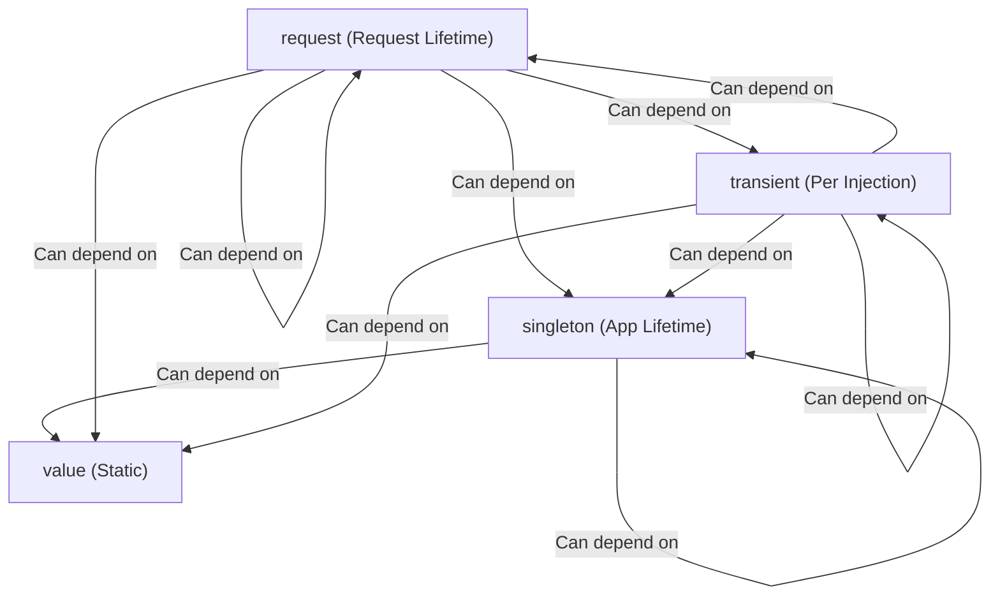

In dependency injection systems, one of the most dangerous bugs is the **captive dependency**: when a service with a longer lifetime (like a singleton) holds a reference to a service with a shorter lifetime (like a request or transient scope).

Nooh enforces lifetime rules **at the TypeScript compiler level**, giving you instant feedback in your IDE before you even run your code.

## The Scope Hierarchy

Nooh defines a strict hierarchy of dependency scopes:



## Compatibility Matrix

| Parent Scope | May Depend On `singleton` | May Depend On `request` | May Depend On `transient` | May Depend On `value` |
| :--- | :---: | :---: | :---: | :---: |
| **`singleton`** | <Badge variant="success">Yes</Badge> | <Badge variant="danger">No</Badge> | <Badge variant="danger">No</Badge> | <Badge variant="success">Yes</Badge> |
| **`request`** | <Badge variant="success">Yes</Badge> | <Badge variant="success">Yes</Badge> | <Badge variant="success">Yes</Badge> | <Badge variant="success">Yes</Badge> |
| **`transient`** | <Badge variant="success">Yes</Badge> | <Badge variant="success">Yes</Badge> | <Badge variant="success">Yes</Badge> | <Badge variant="success">Yes</Badge> |
| **`value`** | <Badge variant="danger">No</Badge> | <Badge variant="danger">No</Badge> | <Badge variant="danger">No</Badge> | <Badge variant="danger">No</Badge> |

## Compile-Time Error Example

If you accidentally inject a `request` service into a `singleton`:

```ts src/dependencies.ts
import { container, singleton, request } from "@nooh-ts/nooh";

export const services = container({
  userSession: request(() => new UserSession()),

  // ❌ Type Error: A singleton dependency cannot depend on a request dependency.
  auditLogger: singleton({
    deps: [services.userSession],
    factory: ({ userSession }) => new AuditLogger(userSession),
  }),
});
```

TypeScript will mark `deps` with the type error:
```text
Type 'DependencyReference<"userSession", UserSession, "request", []> & InvalidDependencyScope<"singleton", "request">' is not assignable...
// "__nooh_dependency_error__": "A singleton dependency cannot depend on a request dependency."
```

## How to Fix Scope Violations

If you encounter a scope error, you have two idiomatic solutions:

1. **Promote the consumer's scope**: Change `auditLogger` from `singleton` to `request`.
2. **Pass dynamic parameters at call time**: Keep `auditLogger` as a `singleton`, but pass `userSession` as an argument to its methods rather than injecting it in the constructor.

```ts
export const services = container({
  userSession: request(() => new UserSession()),

  // Solution 1: Change to request scope
  auditLogger: request({
    deps: [services.userSession],
    factory: ({ userSession }) => new AuditLogger(userSession),
  }),
});
```
